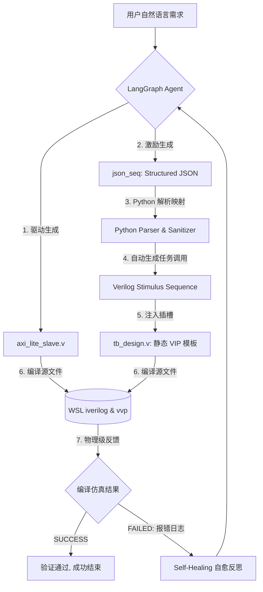

# AXI-Lite GenAI Agent (EDA 芯片设计自愈智能体 V3)

[](https://en.wikipedia.org/wiki/Verilog)
[](https://www.python.org/)
[](LICENSE)
[](https://github.com/langchain-ai/langgraph)

本项目是一个专门针对 **AXI4-Lite 总线 Slave 控制器** 设计与硅前验证（Pre-silicon Verification）开发的 **GenAI 自愈智能体（Self-Healing Agent）**。

我们引入了类似 **UVM (Universal Verification Methodology)** 的核心思想：**将总线协议驱动（静态 Verilog VIP）与验证测试激励（动态 JSON 指令列表）彻底隔离**，结合 Python 映射层和本地物理编译器（WSL Icarus Verilog），实现了芯片设计与仿真的 100% 自动闭环验证。

---

##  核心架构亮点 (UVM-like V3 Architecture)

传统的 LLM 芯片设计 Agent 往往让大模型同时输出 RTL 代码与 Testbench 代码，这会导致严重的 **“双盲死锁 (Dual-blind Deadlock)”** 与 **“语法幻觉 (Syntax Hallucination)”**（LLM 常在激励代码中输出非法的 `initial` 嵌套或错误的 `module` 语法）。

本项目通过以下 V3 架构彻底攻克了这一痛点：



1. **协议与激励彻底解耦**：
   - **静态协议 VIP (Protocol BFM)**：硬编码了一份 100% 符合 AMBA 规范且绝不死锁的 AXI Master VIP 模板 (`tb_template.v`)。
   - **动态验证指令 (Stimulus)**：大模型不直接写 Verilog 激励，而是输出纯净的结构化 JSON 指令序列。
   - **解析规范化 (Parser)**：通过 Python 正则与健壮解析器提取 JSON（支持 synonyms 如 `operation`/`type`，自动规范化 hex/dec 数据），映射为标准的 `axi_write()` 与 `axi_read()` 任务注入模板。
2. **多仿真器语法兼容**：将 VIP 模板中的 SystemVerilog `do-while` 循环重构为标准 Verilog-2005 的 `while` 语句，完美兼容 Icarus Verilog 以及主流商业 EDA 编译器。
3. **LangGraph 状态自愈闭环**：当 `iverilog` 编译报错（如端口命名与 VIP 冲突）或逻辑仿真超时，Agent 自动抓取报错日志反馈给大模型，在 1-2 轮迭代内自动反思并修正 RTL 代码。

---

##  目录结构

```bash
axi_lite_agent/
├── .env                  # [本地忽略] 存放 API 密钥等敏感信息
├── .gitignore            # Git 忽略配置
├── LICENSE               # MIT 开源协议
├── requirements.txt      # Python 依赖清单
├── config.py             # 系统参数配置（API Key/重试次数等）
├── prompts.py            # 大模型 System Prompt（包含黄金 baseline 参考）
├── agent.py              # LangGraph 状态机定义与 JSON 解析器
├── mcp_server.py         # 仿真器接口及 Mock 校验回退机制
├── tb_template.v         # 静态 AXI Master VIP 模板
├── main.py               # 程序入口（交互式选择测试 Spec）
├── design.v              # [自动生成] 大模型最终输出的 synthesizable RTL
└── tb_design.v           # [自动生成] 拼接解析后激励的最终仿真 Testbench
```

---

##  快速开始

### 1. 依赖环境准备
*   **Linux/WSL 环境**（推荐，用于真实 EDA 编译仿真）：
    ```bash
    sudo apt-get update
    sudo apt-get install iverilog vvp
    ```
*   **Python 3.10+** (推荐使用 `uv` 极速包管理器)：
    ```bash
    uv venv
    .venv\Scripts\activate   # Windows PowerShell
    # 或 source .venv/bin/activate (Linux/WSL)
    uv pip install -r requirements.txt
    ```

### 2. 环境变量配置
在项目根目录下创建 `.env` 文件，填入您的大模型 API 密钥：
```env
DEEPSEEK_API_KEY=your_api_key_here
DEEPSEEK_BASE_URL=https://api.deepseek.com/v1
DEEPSEEK_MODEL=deepseek-chat
```

### 3. 运行 Agent
在 WSL 或终端中启动主程序：
```bash
python3 main.py
# 如果在 Windows 终端且安装了 WSL 仿真：
wsl python3 main.py
```
控制台会交互式让您选择测试用例：
1. **Standard Sync AXI-Lite**：同步多寄存器读写测试。
2. **Async CDC AXI-Lite**：跨时钟域自适应测试。

---

## 自愈运行日志示例（Async CDC 测试）

以**测试用例 2（跨时钟域）**为例，由于用户指定了 `axi_clk` 作为时钟名，而 VIP 使用了 `S_AXI_ACLK`。程序在真实 WSL 仿真下记录了以下完美的自愈轨迹：

```log
[Generate Node] -> Generating AXI-Lite Design and Test Sequence...
Parsed raw json_seq:
[ {"type": "write", "addr": "0x00", "data": "0x01"} ... ]

[Validate Node] -> Parsing JSON Sequence to Verilog and running simulation...
--- Mapped Verilog Sequence ---:
axi_write(32'h00, 32'h00000001);
...
[FAILED] Validation FAILED:
COMPILER_ERROR:
tb_design.v:28: error: port 'S_AXI_ACLK' is not a port of dut.
tb_design.v:28: error: port 'S_AXI_ARESETN' is not a port of dut.

[Refine Node] -> Self-Healing (Attempt 1)...
# 大模型提取到上述报错，意识到命名冲突并自我纠正端口...

[Validate Node] -> Parsing JSON Sequence to Verilog and running simulation...
--- Mapped Verilog Sequence ---:
axi_write(32'h00, 32'h00000001);
...
[PASSED] Compilation & Simulation PASSED!

[FINISHED] Agent execution finished.
```

---

## 开源协议

本项目基于 [MIT License](LICENSE) 开源。欢迎大家在 EDA/GenAI 研究中进行二次开发与衍生！
